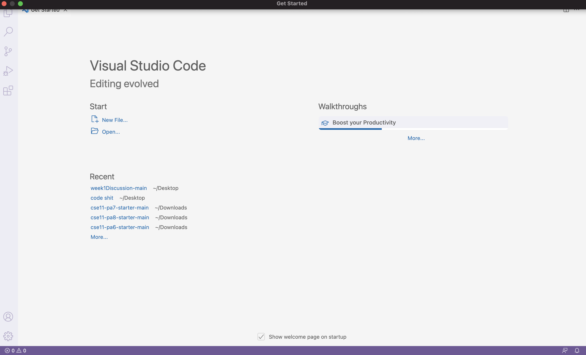
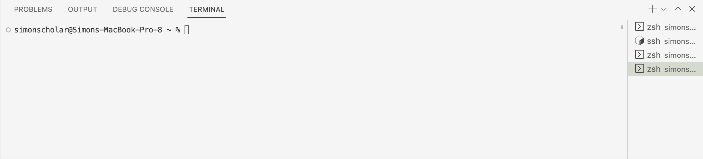
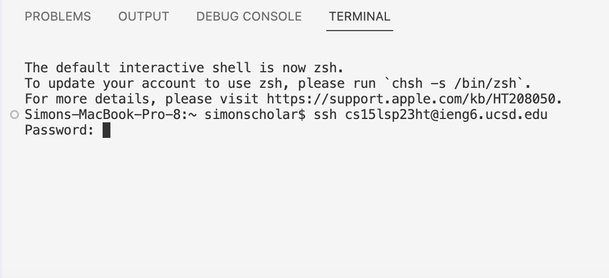
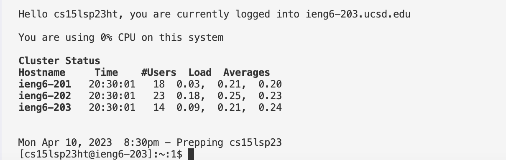
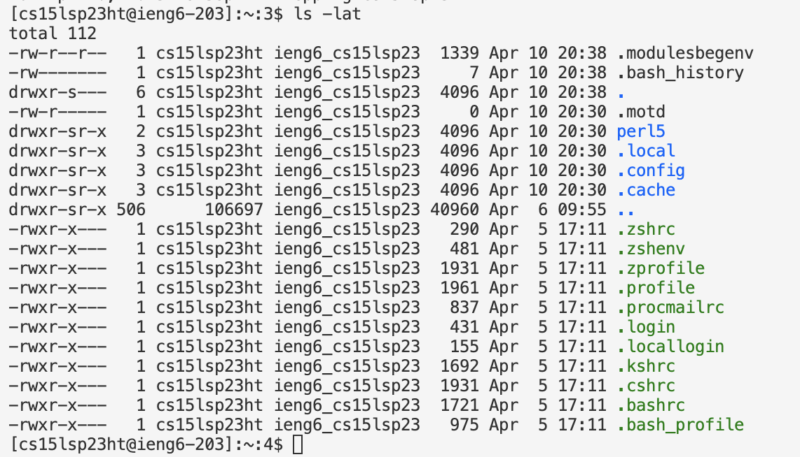
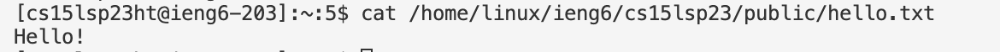

# ✿ CSE 15L: Lab Report 1 (Mac Version) ✿
```
✤ In this lab report you are going to be 
1. Downloading VS Code  
2. Remotely Connecting 
3. Trying Some Commands
```

# 1. Downloading VS Code onto your Mac computer
✩-✩-✩-✩-✩-✩-✩-✩-✩-✩-✩-✩-✩-✩-✩-✩-✩-✩-✩-✩-✩-✩-✩-✩-✩-✩-✩-✩-✩-✩-✩-✩-✩-✩-✩-✩-✩-✩-✩-✩-✩-✩-✩-✩-✩

✩ **[VS CODE](https://code.visualstudio.com/)**
> ✩ Click on the link and follow the instructions and install it onto your computer 

✩

> ✩ When completed, this should be your screen: 



# 2. Remotely Connecting
✩-✩-✩-✩-✩-✩-✩-✩-✩-✩-✩-✩-✩-✩-✩-✩-✩-✩-✩-✩-✩-✩-✩-✩-✩-✩-✩-✩-✩-✩-✩-✩-✩-✩-✩-✩-✩-✩-✩-✩-✩-✩-✩-✩-✩

**First Find Your Course-specific [account](https://sdacs.ucsd.edu/~icc/index.php) for CSE15L**

> ✩ Type in your username (it will be your UCSD email not including @ucsd.edu)

> ✩ Type in Student ID 

> ✩ Reset the Password for your account 

> ✩ [Link](https://drive.google.com/file/d/17IDZn8Qq7Q0RkYMxdiIR0o6HJ3B5YqSW/view?pli=1) for Tutorial on how to reset password

✩

**Second Open Terminal**
> ✩ Drag curser to the menu bar & click on Terminal, new terminal 

✩

**Third Change to Git Bash**
> ✩ In order to change terminal setting to bash drag curser to the + sign in the terminal space & click on "bash"

> ✩ Here is a better representation where the + sign will be: 


✩

> ✩ Now in the terminal type in:
```
✩ $ ssh cs15lsp23zz@ieng6.ucsd.edu  
```
✩ (except change "zz" to the corresponding letters to your account)

✩

> ✩ After sumbitting enter, your terminal should output something like this:
```
⤇ ssh cs15lsp23zz@ieng6.ucsd.edu
The authenticity of host 'ieng6.ucsd.edu (128.54.70.227)' can't be established.
RSA key fingerprint is SHA256:ksruYwhnYH+sySHnHAtLUHngrPEyZTDl/1x99wUQcec.
Are you sure you want to continue connecting (yes/no/[fingerprint])? 
```

> ✩ Type in **Yes**

✩

> ✩ Now your Terminal should look something like this:

✩ In which you can now insert the password you reset in the first step 

> **Keynote: You won't be able to see your password due to secure purposes but it's being typed in as you do**

✩

> ✩ In which nnow your Terminal should now look something like this:
 

**✩CONGRATS! Your computer is now connected to the CSE Basement at UCSD✩** 

# 3. Trying Some Commands 
✩-✩-✩-✩-✩-✩-✩-✩-✩-✩-✩-✩-✩-✩-✩-✩-✩-✩-✩-✩-✩-✩-✩-✩-✩-✩-✩-✩-✩-✩-✩-✩-✩-✩-✩-✩-✩-✩-✩-✩-✩-✩-✩-✩-✩

**We are going to try and run some commands now** 

> ✩ Type in `ls -lat` into the terminal

> ✩ Now it will look like this:   

✩ The command `ls -lat` lists the files and folders of the path `lat`

✩ 

> ✩ Next, type in `cd ~` into the terminal

> ✩ Notice that nothing appears because it's just changing the directory

✩ 

> ✩ Lastly, type in `cat /home/linux/ieng6/cs15lsp23/public/hello.txt` into the terminal 

> ✩ This will appear:


> ✩ The command `cat /home/linux/ieng6/cs15lsp23/public/hello.txt` prints the contents of the given path 


`Andrea Favian`
