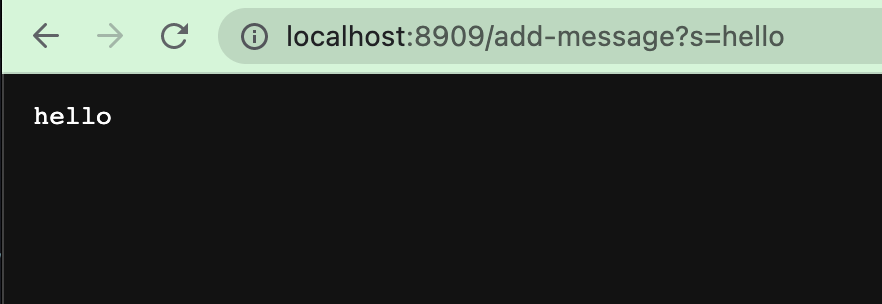
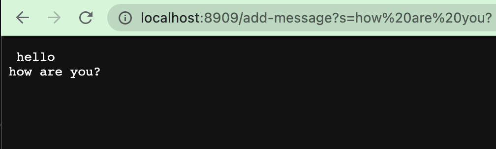
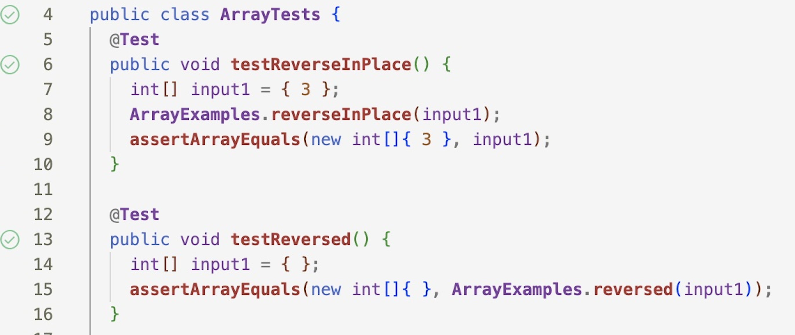

# LAB REPORT 2 - LAB 3 

## PART 1:
> **Code For String Server**


```
import java.io.IOException;
import java.net.URI;


class Handler implements URLHandler {
  String words = " ";

  public String handleRequest(URI url) {
    if (url.getPath().equals("/")) {
      return String.format(" ");
    }
      if (url.getPath().contains("/add-message")) {
              String[] parameters = url.getQuery().split("s=");
              words = words + parameters[1] + "\n";
              return words; 
          }
          return "404 Not Found!";
      }
  }
class StringServer {
  public static void main(String[] args) throws IOException {
    if(args.length == 0){
      System.out.println("Missing port number! Try any number between 1024 to 49151");
      return;
    }

    int port = Integer.parseInt(args[0]);

    Server.start(port, new Handler());
  }
}

```

> **Code for Sever.java**


```
import java.io.IOException;
import java.io.OutputStream;
import java.net.InetSocketAddress;
import java.net.URI;

import com.sun.net.httpserver.HttpExchange;
import com.sun.net.httpserver.HttpHandler;
import com.sun.net.httpserver.HttpServer;

interface URLHandler {
    String handleRequest(URI url);
}

class ServerHttpHandler implements HttpHandler {
    URLHandler handler;
    ServerHttpHandler(URLHandler handler) {
      this.handler = handler;
    }
    public void handle(final HttpExchange exchange) throws IOException {
        // form return body after being handled by program
        try {
            String ret = handler.handleRequest(exchange.getRequestURI());
            // form the return string and write it on the browser
            exchange.sendResponseHeaders(200, ret.getBytes().length);
            OutputStream os = exchange.getResponseBody();
            os.write(ret.getBytes());
            os.close();
        } catch(Exception e) {
            String response = e.toString();
            exchange.sendResponseHeaders(500, response.getBytes().length);
            OutputStream os = exchange.getResponseBody();
            os.write(response.getBytes());
            os.close();
        }
    }
}

public class Server {
    public static void start(int port, URLHandler handler) throws IOException {
        HttpServer server = HttpServer.create(new InetSocketAddress(port), 0);

        //create request entrypoint
        server.createContext("/", new ServerHttpHandler(handler));

        //start the server
        server.start();
        System.out.println("Server Started! Visit http://localhost:" + port + " to visit.");
        }
    }

```
> **Screenshots**
 
- The methods that are called in my code are `handleRequest`, `split`, `url`, and `getPath`. 
- The relevant argument for `handleRequest` would be the object that is representing the incoming HTTP request. For `split` it'd be the specified character that splits it into an array of substrings. The relevant arguments for `url` would be the componets that make an url up. The `host`, `port`, `path` etc. For `getPath` method, the argument `/` is being used as a comparison value to check if the path obtained from url is equal to the root path.
- The values of any relevant fields of the class change by this specific request because of the query parameters it contains. These values are mapped to corrresponding fields in the class. 




- The methods that are called in my code are `handleRequest`, `split`, `url`, and `getPath`. 
- The relevant argument for `handleRequest` would be the object that is representing the incoming HTTP request. For `split` it'd be the specified character that splits it into an array of substrings. The relevant arguments for `url` would be the componets that make an url up. The `host`, `port`, `path` etc. For `getPath` method, the argument `/` is being used as a comparison value to check if the path obtained from url is equal to the root path.
- The values of any relevant fields of the class change by this specific request because of the query parameters it contains. These values are mapped to corrresponding fields in the class. 

## Part 2:
🐛🐛🐛🐛🐛🐛🐛🐛🐛🐛

> **symptom**



> **before-and-after code change required to fix it**

**Original Code W/ Bug**

```
static void reverseInPlace(int[] arr) {
    for(int i = 0; i < arr.length; i += 1) {
      arr[i] = arr[arr.length - i - 1];
    }
  }
``` 

**Fixed Code** 

```
static void reverseInPlace(int[] arr) {
    for(int i = 0; i < arr.length/2; i += 1) {
      int temp = arr[i];
      arr[i] = arr[arr.length - i - 1];
      arr[arr.length - i - 1] = temp;
    }
  }

```

## Part 3:

> Week 2:

Something I learned during week 2 was that the port number can be any number in the thousands, although there was one thing I noticed. For [http://localhost:4000](http://localhost:4000) the number 6,000 did not seem to work when I tried to increment any number during the lab. It might of been a 🐛 because when I tried 6,001 or any number aside from the 6,000 it worked.
Regrading this, I did not know that one reason as to why changing the port number can be useful is because there are scenarios where you want to avoid conflicts with other services running on the same machine and by changing it, it prevents that. 
