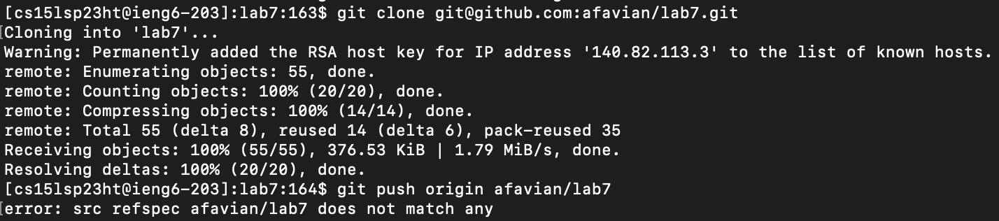
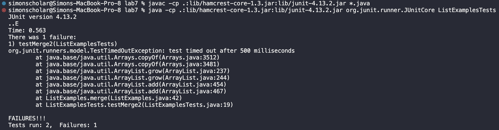
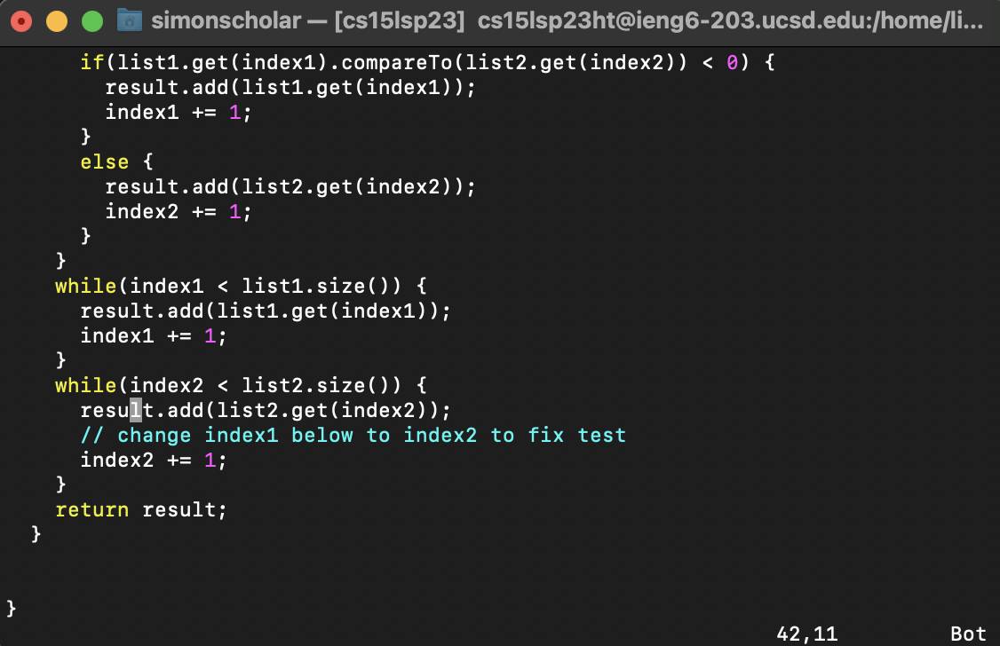
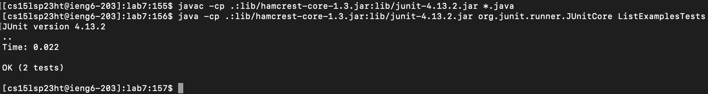
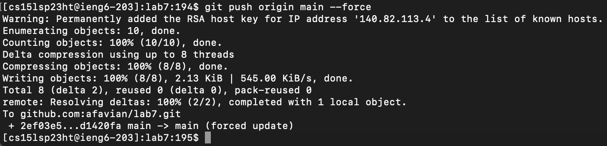
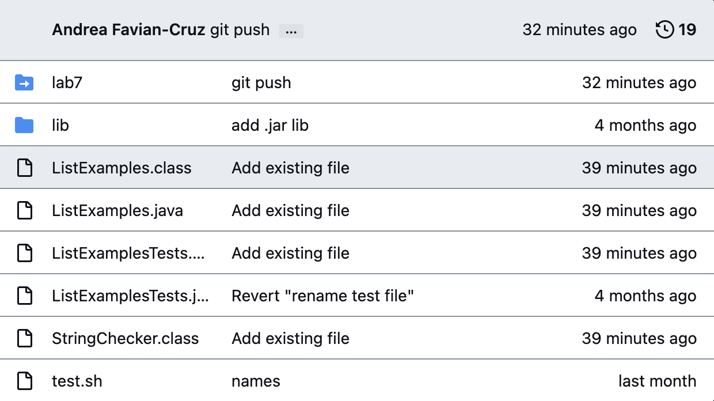

# Lab Report 4

## Step 4: 

> **Keys Pressed**

`<up>` `<enter>` 

The `ssh cs15lsp23ht@ieng6.ucsd.edu` command was 1 up in the search history, so I used the up arrow to access it. 

> **Screenshot**

## Step 5:

>**Keys Pressed**

`<cntrl>` `<v>`

The `git clone git@github.com:afavian/lab7.git` command was copied therefore, I had to just paste it in. 

>**Screenshot**

## Step 6:

>**Keys Pressed**

`<pwd>` 

The command `pwd` lets me see what directory I am in which had to be changed. 

`<cd>` `<lab7>` 

The command `cd` changes the directory. 

`<ls>` `<lab7>` 

The command `ls` lets me see the files in the `lab7` folder. 

`<javac -cp .:lib/hamcrest-core-1.3.jar:lib/junit-4.13.2.jar *.java>`

This command compiles the files.  

`<java -cp .:lib/hamcrest-core-1.3.jar:lib/junit-4.13.2.jar org.junit.runner.JUnitCore ListExamplesTests>`

The expected output of this command was to run the file `ListExamplesTests` without errors but was ran with errors therefore, it needs to be fixed. 

>**Screenshot**

## Step 7:

>**Keys Pressed**

`<vim>` `<ListExamples.java>` 

This command opens the file `ListExamples.java` in `vim` mode. 

`<i>` `<up>` x7 `<left>` x7 

I went into `insert` mode by typing in `i` and used the up arrow seven times and the left arrow seven types in order to reach the error. 

`<delete>` `<2>` 

In order to fix the error, I had to change `index1` to `index2` and by doing so I deleted the 1 and added the 2. 

`<esc>` `<:w>` `<enter>`

This command saves the changes without exiting. 

>**Screenshot**

## Step 8: 

>**Keys Pressed**

`<javac -cp .:lib/hamcrest-core-1.3.jar:lib/junit-4.13.2.jar *.java>` 

This command compiles the files. 

`<java -cp .:lib/hamcrest-core-1.3.jar:lib/junit-4.13.2.jar org.junit.runner.JUnitCore ListExamplesTests>`

The expected output of this command was to run the file `ListExamplesTests` without errors and after fixing the error, it ran without any. 

>**Screenshot**

## Step 9: 

>**Keys Pressed**

`<git add .>` 

This command adds a change in the working directory to the staging area. 

`<git push origin main --force>` 

This command forces the git command in which pushes a local branch to a remote repository. 

>**Screenshot**

