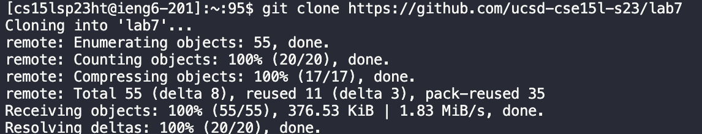

# Lab Report 4

## Step 4: 

> **Keys Pressed**

`<up>` `<enter>` 

The `ssh cs15lsp23ht@ieng6.ucsd.edu` command was 1 up in the search history, so I used the up arrow to access it. 

> **Screenshot**

## Step 5:

>**Keys Pressed**

`<cntrl>` `<v>`

The `git clone https://github.com/ucsd-cse15l-s23/lab7` command was copied in which I had to just paste it in. You are also able to use the `ssh` url;  `git@github.com:afavian/lab7.git` instead of the `https` url and it will give you the same outcome. 

>**Screenshot**

## Step 6:

>**Keys Pressed**

`<pwd>` 

The command `pwd` lets me see what directory I am in which had to be changed. 

`<cd>` `<lab7>` 

The command `cd` changes the directory. 

`<ls>` `<lab7>` 

The command `ls` lets me see the files in the `lab7` folder. 

`<javac -cp .:lib/hamcrest-core-1.3.jar:lib/junit-4.13.2.jar *.java>`

This command compiles the files.  

`<java -cp .:lib/hamcrest-core-1.3.jar:lib/junit-4.13.2.jar org.junit.runner.JUnitCore ListExamplesTests>`

The expected output of this command was to run the file `ListExamplesTests` wihtout errors but was ran with errors in which need to be fixed. 

>**Screenshot**

## Step 7:

>**Keys Pressed**

`<vim>` `<ExampleListTest.java>` 
