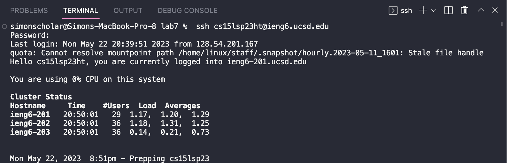

# Lab Report 4

## Step 4: 

> **Keys Pressed**

`<up>` `<enter>` 

The `ssh cs15lsp23ht@ieng6.ucsd.edu` command was 1 up in the search history, so I used up arrow to access it. 

> **Screenshot**

## Step 5:

>**Keys Pressed**

`<cntrl>` `<v>`

The `git clone https://github.com/ucsd-cse15l-s23/lab7` command was copied and I had to paste it in. 

>**Screenshot**

