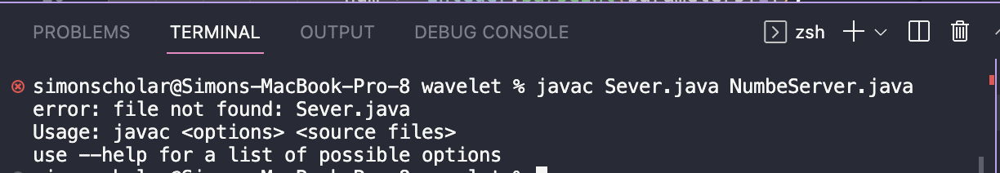
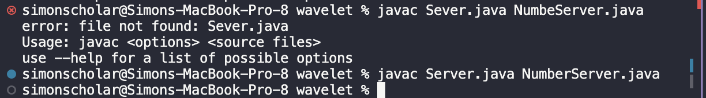

# Lab Report 5 
。°。°。°。°。°。°。°。°。°。°。°。°。°。°。°。°。°。°。°。°

## Part 1 

## • Student Post •

``✎ QUESTION``。° ⚑ POST 。°🗨 ANNOUNCEMENT

**Title:** 
`` Compile Error ``

➥ **Enviroment:** I am on a Mac using bash on my terminal. 
 
➥ **Symptom:** I tried compiling the folder ``wavelet`` on my terminal and was seen with an error and I am not sure why. This is the output I came across with and was expecting both files to compile without any errors. 

 

➥ **Failure-Inducing Input & Context:** I am running ``javac Serve.java & NumbeServer.java`` on the command line in order to compile both files in the ``wavelet`` folder. I also tried doing it separately in which both ran successfully. I am aware that you are able to do both files (or however many you want) in the same command line but when I tried, I was faced with this error. 

## • TA'S Response •

**Title:** 
`` Compile Error ``

➥ Yup that is correct! You are able to compile mulitple files in one command line! I looked over your screenshot and you are using the correct command line  ``javac`` and ``filename.java`` in the bash terminal but have you checked if you are inserting the correct file names? I suggest copying the exact file name letter by letter. :)

## • Student Post •

**Title:** 
`` Compile Error ``

➥ Lifesaver! Thank You! I was able to compile it with no errors, sorry it's been a long day. 

 

。°。°。°。°。°。°。°。°。°。°。°。°。°。°。°。°。°。°。°。°

## Part 2 

**Reflection:**  Something I learned from my lab experience in the second half of this quarter were the many interesting command-line-options there is available for us to use! For example, when researching command for ``Lab Report 3`` I browsed a bit more and found some really interesting options like ``find -mtime 13`` in which gives you a list of files in the directory that has been modified more than 13 days ago. In which you are able to edit the number of days you are looking for. I just thought that the options available were so cool to know and helpful in the future. 

